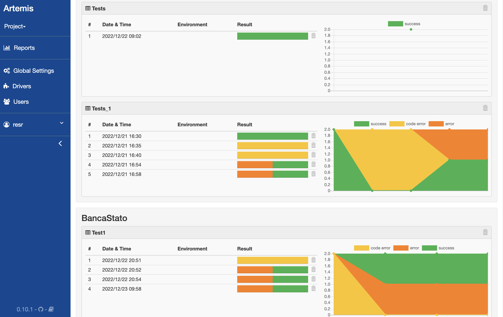
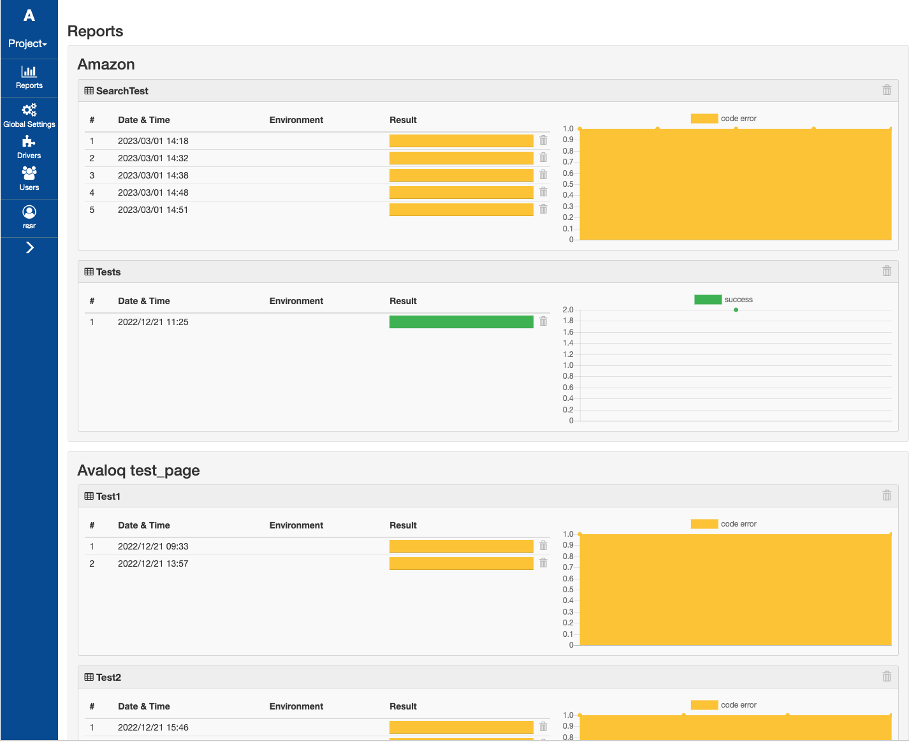

# Artemis 
**Avaloq Robotics Tool Enterprise Monitoring Interface System**

Artemis is a test framework for browser automation forked by Golem (https://github.com/golemhq/golem)
Tests can be written with code in Python, codeless using the web IDE, or both.

**Tests can be written with the web app**
<p align="center">
    
</p>

**But, they are still Python code**
<p align="center">
    
</p>

## Batteries Included

* Multi-user web IDE
* Extended classes for [WebDriver](https://golem-framework.readthedocs.io/en/latest/golem_public_api/webdriver-class.html) and [WebElement](https://golem-framework.readthedocs.io/en/latest/golem_public_api/webelement-class.html)
* More than 200 self documenting [Actions](https://golem-framework.readthedocs.io/en/latest/golem-actions.html)
* [Webdriver-manager](https://github.com/golemhq/webdriver-manager) utility
* Built in parallel test support
* Reporting engine


## Screen Captures

**Report Dashboard**
<p align="center">
    
</p>

**Execution Report**
<p align="center">
    
</p>

**Test Execution Detail**
<p align="center">
    
</p>

## Installation

Artemis  works with Python 3.6+


Read the full installation guide here: [https://golem-framework.readthedocs.io/en/latest/installation.html](https://golem-framework.readthedocs.io/en/latest/installation.html)

## Quick Start

**Create a test directory anywhere in your machine**

```
golem-admin createdirectory <test_directory>
```

**Download the latest webdriver executables**

```
cd <test_directory>
webdriver-manager update
``` 

Webdriver executables are downloaded to the *drivers* folder. For more information check [this page](https://golem-framework.readthedocs.io/en/latest/browsers.html) of the documentation.

**Start the Web Module**

```
golem gui
```

The Web Module can be accessed at http://localhost:5000/

By default, the following user is available: username: *admin* / password: *admin*

**Run a Test From Console**

```
golem run <project> <test>
golem run <project> <suite>
```

Args:

* -b | --browsers: a list of browsers, by default use defined in settings.json or Chrome
* -p | --processes: run in parallel, default 1 (not parallel)
* -e | --environments: a list of environments, the default is none
* -t | --tags: filter tests by tags

## Documentation

[https://golem-framework.readthedocs.io/](https://golem-framework.readthedocs.io/)

## Questions

If you have any question please use the [Gitter channel](https://gitter.im/golem-framework/golem).

## Contributing

If you found a bug or want to contribute code please read the [contributing guide](https://github.com/golemhq/golem/blob/master/CONTRIBUTING.md).

## License

[MIT](https://tldrlegal.com/license/mit-license)

## Credits

Logo based on ["to believe"](https://www.toicon.com/icons/feather_believe) by Shannon E Thomas, [CC BY 4.0](https://creativecommons.org/licenses/by/4.0/)
